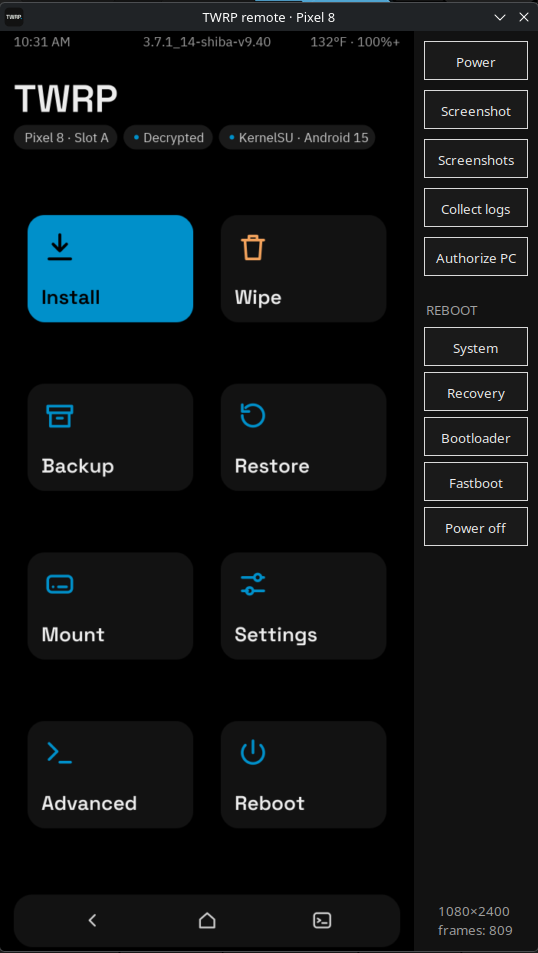
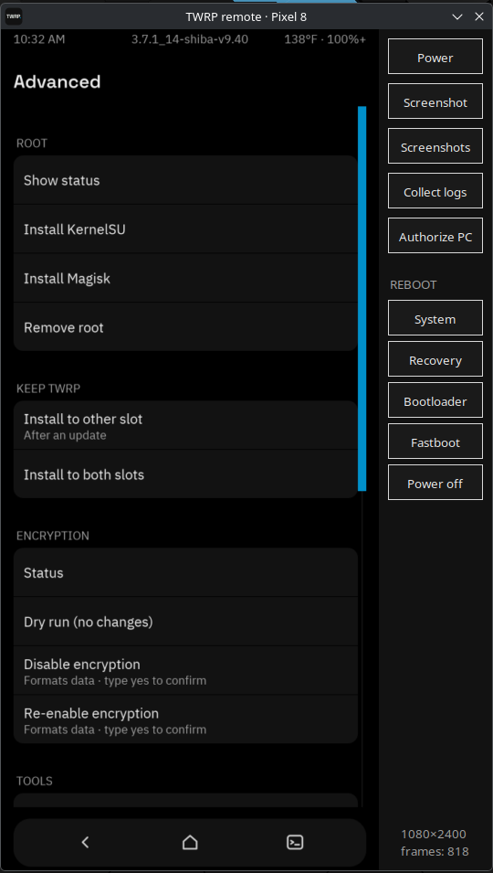

# TWRP for Google Pixel 8 (shiba) — unofficial

A from-scratch build of **TWRP 3.7.1** (twrp-14.1) for the **Google Pixel 8**
("shiba", Tensor G3), with full **FBE decryption**, **TWRP that survives OTA
updates**, built-in **root** and **encryption** tools, and a PC **remote
control** for the recovery screen.

**Download:** [latest release](https://github.com/strubedo/twrp_device_google_shiba/releases/latest)
— one flashable zip for every firmware. **Your phone must be rooted** (KernelSU or
Magisk): flash the zip from the root app, or from TWRP to update it.

<p align="center">
  
  &nbsp;
  
</p>

> ### 🖥️ TWRP Remote — control TWRP from your PC
> See the phone's recovery screen **live on your PC**, tap and swipe with the mouse,
> type with your keyboard, take **screenshots**, **collect logs** for bug reports,
> reboot to any mode — over USB, nothing on the network. When the phone is in
> Android, it hands over to scrcpy. One-command installer for Linux (Windows
> installer included, not yet tested). Both screenshots above were taken with it.
> [More below](#twrp-remote-pc) · GPL-3.0.

**Status:** tested on Android 14 and Android 15, including updating from 14 to 15
with TWRP. Android 16 and 17 support is prepared and checked offline (see
`COMPAT_A14-A17.md`); real-device testing is next.

| Android | Firmware tested | Kernel | Status |
|---|---|---|---|
| 14 | AP2A.240605.024, AP2A.240905.003 | 5.15 | ✅ tested, incl. OTA updates from TWRP |
| 15 | BP1A.250405.007.B1 (April 2025) | 6.1 | ✅ tested: OTA 14 → 15 from TWRP (TWRP + root kept), TWRP before and after the first boot, decryption with Android 15's own security services |
| 16 | CP1A.260505.005 | 6.1 | 🔧 prepared (image fits; decryption services' library needs checked and covered), testing next |
| 17 | CP3A.260905.009 | 6.1 | 🔧 prepared (image fits; decryption services' library needs checked and covered), testing next; new lock-screen format unverified |

## Features

**Decryption & storage**
- Full **file-based encryption** support: unlocks `/data` with your **PIN**
  (Titan M2 / Weaver / Gatekeeper / KeyMint), no key upgrades, Android untouched.
- **Decrypts even without `/vendor`** (damaged `super`, a slot without a system,
  or vendor binaries that can't run in recovery): a fallback chain of AOSP's
  Trusty KeyMint and Gatekeeper built from source plus LeeGarChat's Titan M2
  Weaver daemon, using the OS version/patch level saved on the last normal start.
- **Touchscreen without `vendor_dlkm`**: TWRP takes the touch drivers from the
  slot's own firmware; when that can't be read, it loads a matching set bundled
  for each Google kernel build (Android 14 to 17). Custom kernels aren't covered
  (a module only loads into the kernel it was built for).
- If decryption is impossible because the booted slot's firmware is **older
  than your data's keys** (the security chip refuses it), TWRP says so on the
  main screen instead of failing silently.
- Fixes TWRP changes to `/data` being silently rolled back after an update
  (f2fs checkpoint commit).
- **MTP**, **USB OTG** (flash drives, keyboards) with auto-mount.

**Updates**
- **Install OTA zips from TWRP** with two options:
  - *Reflash TWRP after flashing an OTA* — TWRP is grafted into the updated
    slot's `vendor_boot` and verified byte for byte.
  - *Reinstall root after flashing an OTA* — the same root tool (KernelSU or
    Magisk) is put on the updated slot, checked against **its** kernel.
- **KEEP TWRP** menu: install TWRP to the other slot or both slots.
- Working **slot switching** (Pixel's AIDL boot HAL, built from source; never
  touches the anti-rollback fuses).

**Root** (Advanced → ROOT)
- Install **KernelSU** (official v3.3.0, LKM mode) or **Magisk** (30.7), or
  remove root. Every change is state-checked, backed up, verified after writing,
  and rolled back on any mismatch. KernelSU refuses unsupported kernels (KMI check).
- **KernelSU app installed for you**: put the official `KernelSU_*.apk` in
  `Download/`; if the app isn't installed yet, Install KernelSU sets it up to
  install itself at the next boot (one-shot module, removes itself).

**Encryption** (Advanced → ENCRYPTION) — *experimental*
- Disable or re-enable `/data` encryption. Our own implementation: a small
  overlay (in `super`) shadows `/vendor/etc/init/hw` at first-stage boot, with the
  `/data` encryption flags removed from the fstab; everything is checked, backed
  up, verified after writing and rolled back on failure. **Disabling formats
  `/data`.** A *Dry run* builds and verifies everything without writing.
  Verified on a real phone up to the writes; a full disable-and-boot test on a
  wiped phone is still pending.
- OTA guard: if encryption is disabled, an OTA can't keep it disabled — TWRP keeps
  the phone on the current slot instead of booting an unbootable one.

**Tools** (Advanced → TOOLS)
- **Enable USB debugging** in Android (root module; the PC is authorized via the
  normal "Allow" prompt, or the remote's *Authorize PC*).
- **Collect logs**: one archive with everything needed to diagnose a problem
  (TWRP and crypto logs, kernel log, modules, partitions, update state,
  versions), saved to Download/ (or a USB drive, if /data is locked). The serial
  number and IMEI are removed first. **When reporting a problem, attach this.**
  TWRP Remote has a *Collect logs* button that saves it straight to the PC.

**Look**
- **Graphite** theme: dark, Material-style, with live status chips
  (slot, data state, root).

## TWRP Remote (PC)

`twrp_remote/` — view and control TWRP from your PC over USB (adb): live screen,
touch, keyboard typing, reboot menu, screenshots. Switches to **scrcpy**
automatically when the phone is in Android. Linux and Windows.

```
# Linux: installs what's missing (adb, Python Tk/venv; scrcpy optional - apt, dnf,
# pacman or zypper), its own Python environment, and the menu entry
./twrp_remote/install_linux.sh            # --uninstall to remove
# Windows: build_windows.bat builds "TWRP Remote.exe" (needs Python 3), then
# install_windows.bat installs it, gets adb (and optionally scrcpy) from their
# official sources and adds a Start menu shortcut (not yet tested on Windows)
```

Screenshots are saved to **Pictures/TWRP Remote**; the **Screenshots** button opens that folder.

## ⚠️ Before you start

- **Unlocked bootloader required** (wipes your phone the first time).
- **Root required** to install: KernelSU or Magisk (the flashable zip is installed
  from the root app).
- **Anti-rollback (May 2025 and later):** Google's May 2025 update raised the
  bootloader's anti-rollback version on the Pixel 8. After it, **older Android 15
  builds can't be flashed and booted** - never flash firmware older than yours.
  The first time you update to **May 2025 or newer**, the other slot still holds
  the old bootloader; if the phone ever falls back to it, it won't boot. Google's
  fix: after the first successful boot, **install the same full OTA once more**
  (sideload, or Install it again from TWRP) so both slots carry the new
  bootloader. Phones that later took regular monthly updates already have both
  slots updated. See the warnings on Google's
  [factory images page](https://developers.google.com/android/images#shiba) and
  the pinned thread in the XDA Pixel 8 forum.
- **TWRP never touches the bootloader**: the installers change only
  `vendor_boot`, so installing TWRP has no anti-rollback effect.
- **Back up** your data. Disabling encryption formats `/data`.
- Going from Android 14 to 15+ is one-way for your data (downgrading needs a wipe).
- **After an update's first boot, the old slot is gone.** Pixels use virtual A/B:
  once Android finishes merging the update in the background, the previous
  slot's system is released. Test TWRP on the updated slot (Reboot → Recovery)
  **before** booting Android if you want a way back.
- On Android 15+, TWRP's install drops the `vendor_boot` part used only by the
  developer option **"Boot with 16 KB page size"** (it doesn't fit next to
  TWRP). That option needs the stock `vendor_boot`; normal booting is unaffected.
- This is unofficial and comes with **no warranty**.

## Installation

> Tested on a real Pixel 8 (2026-10-02): first install onto a slot with Google's
> stock vendor_boot, both the root and the factory-image path; plus simulated
> phones for every refusal case.

TWRP lives in `vendor_boot`. The release doesn't ship an image built for one
firmware: both installers **graft TWRP onto your phone's own `vendor_boot`**
(the same operation as *Reflash TWRP after OTA*), keep a backup of the
original, and verify what they write - so they work on **any firmware build**.

### Option A: flashable zip (rooted phone, or updating TWRP)

`shiba-twrp-<version>-flashable.zip` - one file for every firmware. Flash it with:
- the **KernelSU** or **Magisk** app (*Modules → Install from storage*) on a rooted
  phone - no PC needed. KernelSU shows an "installer" module until the next
  reboot, then it removes itself;
- **TWRP** (*Install*) - to update TWRP to a new version.

It installs to **both slots** (only the running one while an update is in
progress), backs up each original `vendor_boot` to Internal Storage
(`TWRP/vendor_boot_backups/`), reads every write back and restores the original
on any mismatch. Then reboot to recovery.

### Option B: from a PC (`install_twrp.py`)

Requirements: unlocked bootloader; Android platform-tools (`adb`, `fastboot`);
Python 3 with `lz4` (`pip install lz4`); the phone in Android with USB debugging on.

Your `vendor_boot` is read **from the phone** if it's rooted (KernelSU or Magisk:
allow the Shell app root when asked). Otherwise download the **factory image for
your exact build** (Settings → About phone → Build number) from
<https://developers.google.com/android/images#shiba> into `Downloads/` - the
installer finds it and refuses one for a different build.

```
python3 install_twrp.py --dry-run     # check everything, build + verify the image, flash nothing
python3 install_twrp.py               # install
```

Before flashing it re-checks in fastboot: product `shiba`, bootloader unlocked,
same slot as Android, image fits the partition. Then in TWRP: enter your PIN,
**Advanced → KEEP TWRP → Install to both slots**.

To remove TWRP: flash the backup it printed (`fastboot flash vendor_boot_X <backup>`),
or your firmware's stock `vendor_boot`.

(Why not `fastboot fetch`? Stock fastbootd only allows it on debuggable builds.)

## Building

Requires a TWRP **twrp-14.1** minimal manifest checkout (~90 GB), Linux, 16 GB+ RAM.

```
repo init --depth=1 -u https://github.com/minimal-manifest-twrp/platform_manifest_twrp_aosp.git -b twrp-14.1
repo sync
git clone <this repo> device/google/shiba
# apply patches/*.patch to bootable/recovery, frameworks/native, system/core, system/vold,
# hardware/interfaces, system/tools/aidl, external/rust/crates/libc and
# external/rust/crates/downcast-rs (each file is named after its repository path)
cd device/google/shiba && ./build.sh            # ./build.sh --flash to flash a connected phone
```

`build.sh` runs 35+ safety gates and refuses to produce an image if any fails.
It needs the stock `vendor_boot.img` of your firmware in `~/shiba-stock/factory/`.

## Version history

Newest first. Every version is a git tag in this repository; its commit message
has the technical details.

**v9.42** (2026-10-03) - **USB OTG works on Android 15 and later.** In recovery the
USB-C controller registers the port sink-only, so flash drives were never
detected; TWRP now switches the port to host mode itself when nothing powers it
(OTG ID + 5 V for the device, after LeeGarChat's method), mounts the drive at
`/usb-otg`, and returns to PC mode (adb/MTP) when it's unplugged. The OTG
kernel module finds its target at runtime on 6.1 (more robust on new firmware).

**v9.41** (2026-10-03) - **Decryption without `/vendor`**: when the slot's vendor
binaries can't run (damaged `super`, a slot without a system, a firmware TWRP
can't run them on), a fallback chain decrypts with AOSP's Trusty KeyMint and
Gatekeeper built from source and LeeGarChat's Titan M2 Weaver daemon; the OS
version/patch level is saved to `/metadata` on every normal start for it.
**Touchscreen without `vendor_dlkm`**: bundled touch drivers for each Google
kernel build (Android 14-17). **Clear message** when the booted slot's firmware
is older than your data's keys (the security chip refuses it), on the main
screen, with the Locked and root chips still shown.

**v9.40** (2026-10-02) - **Flashable zip installer**: one zip for every firmware,
flashed from the KernelSU/Magisk app (no PC) or from TWRP (updates); both slots,
backed up and verified. **Own "disable encryption" implementation** (no
third-party installer; experimental): overlay partition + first-stage mount line,
fully verified, with a *Dry run* that proves everything before writing. **Collect
logs** (Advanced → TOOLS, and in TWRP Remote). **TWRP Remote installers** for
Linux (all dependencies) and Windows; screenshots to Pictures/TWRP Remote.
Builds use the Android 15 stock base.

**v9.39** (2026-10-02) - TWRP no longer hangs when decryption is impossible (shows
"Decryption unavailable"); "No Android" on a slot without a system; installer
partition-size check fixed.

**v9.38** (2026-10-02) - Compatibility library extended for Android 16 and 17
security services; Android 15–17 checked with zero missing symbols.

**v9.37** (2026-10-02) - Main screen shows the slot's Android version; build-time
firmware guard for flashing; image-size check for the theme.

**v9.36** (2026-10-02) - **Android 15 ready**: snapshot-aware partition mapping during
an update, libc++ compatibility for Android 15's Titan services, slot-switch fix
after OTAs, fixes for the 16K vendor_boot part and the 6.1 USB OTG module.

**v9.35** (2026-10-02) - **Universal installer**: `install_twrp.py` installs TWRP on
any firmware build by grafting it onto your phone's own `vendor_boot` (read from a
rooted phone, or from the factory image for your exact build), with a backup and
full re-checks before flashing. Release packaging with checksums.

**v9.34** (2026-10-02) - App installers for both root tools: after Install KernelSU
or Install Magisk, the matching app installs itself at the next boot (official APK
from Download/, or Magisk's stub).

**v9.33** (2026-10-02) - KernelSU app installer (first version). Build check that
keeps TWRP within the size the bootloader can load.

**v9.32** (2026-10-02) - Touch drivers come from the phone's own firmware, so the
touchscreen works on every Android version without bundled drivers.

**v9.31** (2026-10-01) - Boot control built from Google's open source (no prebuilt
binary); it can never touch the anti-rollback fuses from recovery.

**v9.30** (2026-10-01) - TWRP stays awake while the PC remote is connected.

**v9.29** (2026-10-01) - Fix: switching slots (Reboot > Slot A/B) now really changes
the boot slot. Settings are saved immediately, so they survive any reboot.

**v9.28** (2026-10-01) - *Reinstall root after flashing an OTA*: one install updates
the phone, keeps TWRP and puts root back.

**v9.27** (2026-10-01) - OTA updates from TWRP verified end to end; flashing targets
the current slot.

**v9.26** (2026-10-01) - OTA guard for disabled encryption: TWRP keeps the phone on
the working slot instead of booting one that can't start.

**v9.25** (2026-10-01) - Root status chip on the main screen (KernelSU / Magisk /
Not rooted). PC remote: *Authorize PC* for USB debugging.

**v9.24** (2026-10-01) - PC remote for Linux and Windows; switches to scrcpy when
the phone is in Android.

**v9.23** (2026-10-01) - PC remote: type on the phone from the PC keyboard.

**v9.22** (2026-10-01) - **TWRP Remote**: view and control TWRP from the PC over USB.

**v9.21** (2026-09-29) - Advanced > TOOLS: Enable USB debugging in Android.

**v9.20** (2026-09-29) - Fix: changes made to /data in TWRP were rolled back at
the next boot (f2fs checkpoint); they now persist.

**v9.19** (2026-09-29) - Graphite theme: redesigned Advanced page with grouped sections.

**v9.18** (2026-09-29) - Graphite theme complete: new main screen with live status chips.

**v9.16** (2026-09-29) - Graphite theme: new splash screen, header and status line.

**v9.15** (2026-09-29) - Graphite theme: redesigned PIN screen.

**v9.14** (2026-09-29) - Graphite theme: main-menu icons.

**v9.13** (2026-09-29) - Graphite theme: all theme images drawn from vector sources.

**v9.12** (2026-09-29) - **Graphite theme** (first stage): dark palette, new fonts.

**v9.11** (2026-09-29) - Preparation for Android 16 firmware (newer vendor HALs).

**v9.10** (2026-09-29) - Install KernelSU checks that the kernel is supported first.

**v9.9** (2026-09-29) - **Encryption menu**: disable or re-enable /data encryption
(DFE-NEO). Version number shown from the release tag.

**v9.8** (2026-09-29) - MTP: browse the phone's storage from a PC while in TWRP.

**v9.7** (2026-09-27) - USB OTG drives mount automatically.

**v9.6** (2026-09-27) - **USB OTG** in recovery (flash drives, keyboards).

**v9.5** (2026-09-27) - **Keep TWRP after OTA** complete: install TWRP to the other
or both slots; reflash automatically after an update.

**v9.4** (2026-09-27) - Keep TWRP after OTA: the image tool behind it (vbgraft).

**v9.3** (2026-09-27) - Faster startup.

**v9.1** (2026-09-27) - Decryption no longer changes any keys on the phone.

**v9** (2026-09-27) - **Full decryption**: /data unlocks with your PIN (Titan M2).

**v6** (2026-09-26) - Root menu (KernelSU / Magisk / remove) with on-screen
output. TWRP boots, without decryption.

## License

Apache License 2.0 (`LICENSE`), except **TWRP Remote** (`twrp_remote/`), which is
GPL-3.0-or-later (`twrp_remote/LICENSE`), and the parts listed in
`THIRD_PARTY_NOTICES.md` (TWRP changes GPL-3.0, OTG kernel module GPL-2.0,
bundled KernelSU/Magisk/BusyBox, fonts under OFL-1.1).

## Credits

TeamWin (TWRP) · LeeGarChat (the OrangeFox Pixel tree whose decryption research
made this possible, and DFE-NEO, whose approach inspired our encryption tool) ·
topjohnwu (Magisk) · tiann and
contributors (KernelSU) · Google/AOSP · IBM (Plex) · Florian Karsten (Space Grotesk).
